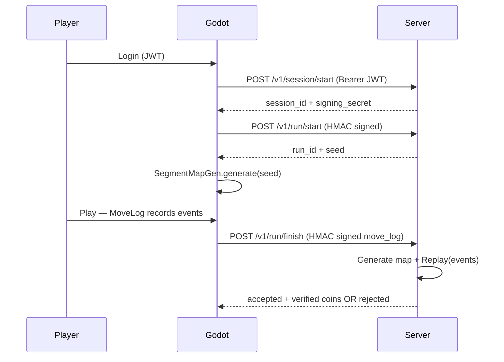

# Anti-cheat and secure scoring

This document explains how the Runner game prevents score hacking, how **HMAC request signing** works step by step, which attacks are blocked, and what you can add next.

Related code:

| Layer | Files |
|-------|--------|
| Godot client | `scripts/secure/run_session.gd`, `api_client.gd`, `hmac_sign.gd`, `move_log.gd`, `segment_map.gd`, `level.gd` |
| Go server | `internal/api/server.go`, `internal/auth/hmac.go`, `internal/sim/replay.go`, `internal/store/memory.go` |

---

## 1. Core idea: server does not trust the client score

The browser only sends a **replay log** (`move_log`) of what happened during a segment. The server:

1. Knows the **seed** that generated coins and rocks for that segment
2. Regenerates the same map from that seed
3. **Replays** every event in the log (lane changes, jumps, coin pickups, collisions)
4. Accepts or rejects the submission and updates the leaderboard only if replay is valid

The client never sends `"coins": 999`. It sends events like `"kind": "coin", "object_id": 42, "lane": 1, "distance": 312.5`. The server counts coins only if object `42` is really a coin at that lane and distance on **its** copy of the map.



---

## 2. Layers of protection

### 2.1 Login and identity (JWT)

Production uses `API_BASE` pointing at the real API. Then:

- **Register / login** is required before PLAY
- `POST /v1/session/start` requires `Authorization: Bearer <JWT>`
- Scores are tied to a user in MySQL (`best_coins`, leaderboard)

This stops anonymous fake high scores on the public leaderboard.

### 2.2 Server-owned level layout (secure spawns)

With `SECURE_SPAWNS = true` in `sim_constants.gd`:

- Random obstacles and coins are **not** chosen only on the client
- Server returns a **seed** per run / segment via `/v1/run/start` and checkpoint responses
- Client and server both run the same `SegmentMapGen` algorithm (`SIM_VERSION` must match)
- Every spawn has a fixed `object_id`, `lane`, and `distance`

You cannot claim a coin that was never on the map, or pick one from the wrong lane.

### 2.3 Move log (client replay input)

`MoveLog` (`scripts/secure/move_log.gd`) records during play:

| Event | Fields | Purpose |
|-------|--------|---------|
| `lane_change` | from, to, distance, t_ms | Prove legal lane switches |
| `jump_start` / `jump_land` | distance, t_ms | Prove jump state (e.g. no rock hit while airborne) |
| `coin` | object_id, lane, distance | Tie pickup to map object |
| `collision` | object_id, lane, distance | Tie death to a real rock |

Each segment submission also includes:

- `sim_version`, `segment_index`, `seed`, `initial_lane`
- `final_distance`, `client_duration_ms`, `end_reason`

### 2.4 Server replay validation

Go code: `internal/sim/replay.go`. The server simulates your log against the map from your seed.

| Cheat attempt | Server check | Rejection code |
|---------------|--------------|----------------|
| Fake coin pickup | Coin must exist at that `object_id` | `GHOST_OBJECT` |
| Coin wrong type / lane / position | Map entry must match | `PICKUP_FRAUD` |
| Fake crash or wrong rock | Rock must exist, lane + distance match | `FAKE_CRASH` |
| Hit rock while jumping over it | Collision while airborne is invalid | `FAKE_CRASH` |
| Claim death with no collision event | `end_reason` must match events | `FAKE_CRASH` |
| Spam lane switches | Min 100 ms between lane changes | `LANE_SPAM` |
| Finish segment too early | Distance vs scroll speed 15 | `SPEED_HACK` |
| Run too fast for reported time | `client_duration_ms` vs distance | `SPEED_HACK` |
| Wrong segment or seed | Must match server run state | `SEGMENT_ORDER`, `SEED_MISMATCH` |
| Submit same segment twice | Duplicate segment index | `DUPLICATE` |
| Old client physics | `sim_version` must match | `INVALID_SIM_VERSION` |

Only **server-verified** coin counts update `run_total_coins`, `final_coins`, and `best_coins`.

### 2.5 HMAC signing (API tampering)

Run lifecycle calls (`/v1/run/start`, `/v1/run/checkpoint`, `/v1/run/finish`) are **signed**. See section 3 below.

### 2.6 Rate limiting

On signed routes the server limits:

- Requests per IP (e.g. 100/minute)
- Requests per session (e.g. 30/minute)
- Run starts per session (e.g. 5/minute)

This reduces brute-force and spam.

### 2.7 Production settings

| Setting | Value in production | Why |
|---------|---------------------|-----|
| `SECURE_SPAWNS` | `true` | Server-controlled map |
| `OFFLINE_FALLBACK` | `false` | No fake offline scored runs when API fails |
| `DEBUG_API` | `false` | No move logs / API details in browser console |
| `API_BASE` | HTTPS public URL | Browser cannot call localhost for real users |
| Server `DEBUG` | `0` | No verbose auth/replay logs on server |

---

## 3. HMAC signature verification — detailed flow

HMAC protects **run API requests** after login. It does **not** replace JWT (login) or replay validation (score truth). All three work together.

### 3.1 Two different secrets (important)

| Secret | Who has it | Used for |
|--------|------------|----------|
| **JWT secret** | Server only (`JWT_SECRET` env) | Login token issue/verify |
| **Signing secret** | Server + client in RAM for one game session | HMAC on run/checkpoint/finish |

The signing secret is created when the user calls `POST /v1/session/start` (with JWT). It is returned **once** as base64, stored in `RunSession.signing_secret` in Godot memory only — **not** in `localStorage`, not in the exported game files.

### 3.2 Step-by-step: starting a signed run

**Step A — Login (unsigned + JWT)**

```
POST /v1/auth/login
Authorization: (none)
Body: { "index_number": "...", "phone_number": "..." }
→ Response: { "token": "eyJ..." }
```

**Step B — Game session (JWT, not HMAC yet)**

```
POST /v1/session/start
Authorization: Bearer eyJ...
Body: {}
→ Response: {
     "session_id": "uuid-...",
     "signing_secret": "base64-32-random-bytes",
     "expires_at": "..."
   }
```

Godot stores `session_id` and decodes `signing_secret` into `PackedByteArray`.

**Step C — Run start (HMAC signed)**

Godot (`api_client.gd` → `post_signed`):

1. Build JSON body, e.g. `{}` for run start or `{ "run_id": "...", "move_log": { ... } }` for finish
2. `timestamp` = current Unix time in **milliseconds** (string)
3. `nonce` = new random UUID (unique per request)
4. Compute signature (see 3.3)
5. Send POST with headers:

```
Content-Type: application/json
X-Session-Id: <session_id>
X-Timestamp: <timestamp>
X-Nonce: <nonce>
X-Signature: <hex hmac>
```

**Step D — Server verification** (`server.go` → `signed()` middleware)

Order of checks:

1. **Read body** — raw bytes used for hash and replay
2. **Load session** by `X-Session-Id` — must exist and not be expired
3. **Parse timestamp** — must be valid integer ms
4. **Clock skew** — `|now - timestamp| ≤ 60000` ms (1 minute). Stops very old captured requests
5. **Nonce** — `TryUse(session_id, nonce)` — each nonce usable once per ~120 s. Stops **replay attacks** (resending the same valid request)
6. **HMAC verify** — recompute signature with session’s signing secret; compare with `X-Signature` using constant-time compare
7. **Rate limits** — IP and session buckets
8. **Handler** — e.g. run replay for checkpoint/finish

If any step fails → `401` with `invalid_session`, `invalid_timestamp`, `timestamp_out_of_range`, `nonce_reused`, `invalid_signature`, or `429 rate_limited`.

### 3.3 Canonical string and signature (exact algorithm)

Client (`hmac_sign.gd`) and server (`internal/auth/hmac.go`) use the **same** formula:

```
body_hash = SHA256(body_utf8) as lowercase hex

canonical = method + "\n" + path + "\n" + timestamp + "\n" + nonce + "\n" + body_hash

signature = HMAC-SHA256(key=signing_secret, message=canonical) as lowercase hex
```

Example for finish:

```
method    = POST
path      = /v1/run/finish
timestamp = 1719052800123
nonce     = a1b2c3d4-e5f6-7890-abcd-ef1234567890
body      = {"run_id":"...","move_log":{...}}
body_hash = sha256(body) → e3b0c44298fc1c149afbf4c8996fb92427ae41e4649b934ca495991b7852b855 (example)

canonical = "POST\n/v1/run/finish\n1719052800123\na1b2c3d4-...\ne3b0c442..."
signature = hmac_sha256(signing_secret, canonical)
```

**Why hash the body in the canonical string?**

- Any change to JSON (extra coin, different distance, different `run_id`) changes `body_hash` → signature fails
- Attacker cannot swap body after signing without knowing `signing_secret`

**Why include method and path?**

- Signature for `/v1/run/checkpoint` cannot be reused on `/v1/run/finish`

**Why timestamp + nonce?**

- **Timestamp**: limits window for stolen requests
- **Nonce**: even within the window, the **exact same request** cannot be sent twice

### 3.4 Attacks vs HMAC + middleware

| Attack | Blocked? | How |
|--------|----------|-----|
| Edit JSON body in DevTools after client built request | Yes | Signature covers body hash |
| Replay captured request later | Mostly | Timestamp window + nonce one-time use |
| Replay same request twice quickly | Yes | Nonce reuse rejected |
| Use someone else’s session_id without secret | Yes | HMAC fails |
| Call run/finish without logging in | Yes | No valid session / secret from `/session/start` |
| Brute-force signing secret | Impractical | 256-bit random secret |
| Sign with JWT instead of signing secret | No effect | Different endpoints; run routes require HMAC |
| Modify move_log to add fake coins **if** they forge signature | Only if they steal secret | Without secret, request rejected before replay |
| Modify move_log **and** know secret | Request accepted for processing | **Replay engine** still rejects impossible coins (`PICKUP_FRAUD`) |

HMAC protects **transport and API integrity**. **Replay validation** protects **score truth**. Both are required.

### 3.5 What HMAC does **not** stop alone

- A modified client that **plays legitimately** but faster (human/bot) — only replay timing rules help
- Client that **extracts signing_secret from memory** and builds valid signed requests with fake logs — replay still catches impossible events unless they perfectly simulate the game
- Fully patched WASM/JS that ignores server — user only cheats locally; leaderboard unchanged if they never send valid finish

---

## 4. End-to-end cheat scenarios

### Scenario A: “Set coins to 999 in JavaScript”

- Client might show 999 locally
- `move_log` sent on finish only contains logged `coin` events
- Server replay counts only valid pickups → rejects or low score
- Leaderboard uses server `final_coins`

### Scenario B: “Resend a good finish request from yesterday”

- Nonce already used or timestamp too old → `nonce_reused` or `timestamp_out_of_range`

### Scenario C: “Copy another player’s finish body, change user”

- JWT/session binds run to user; HMAC tied to victim’s signing secret; run_id belongs to their session → fails

### Scenario D: “Play offline / block API, still get score”

- Production: `OFFLINE_FALLBACK = false` → run does not start or finish is not accepted online
- Local-only score has no leaderboard effect

---

## 5. What you can do next (recommended improvements)

Priority roughly highest impact first.

### 5.1 Server / ops (high impact)

| Improvement | Why |
|-------------|-----|
| **HTTPS everywhere** | Protect JWT and signing secret in transit |
| **Strong `JWT_SECRET`** | `openssl rand -hex 32`; never commit `.env` |
| **Exact `CORS_ORIGIN`** | Only your GitHub Pages / domain |
| **Persist sessions in Redis/DB** | Survive API restarts; optional session revoke |
| **WAF / reverse proxy** | nginx/Caddy rate limit, TLS, IP blocklists |
| **Monitor rejections** | Log counts of `PICKUP_FRAUD`, `SPEED_HACK`, `invalid_signature` — detect attack waves |
| **Shorten session TTL** | Signing secret valid less time = smaller theft window |

### 5.2 Replay / game logic (high impact)

| Improvement | Why |
|-------------|-----|
| **Tighten timing slack** | Reduce `TimingSlackRatio` / `TimingSlackMS` if false positives are low |
| **Cap max coins per segment** | Upper bound from map generator; reject over-cap |
| **Server-side run timeout** | Abandon runs open too long |
| **Anomaly scoring** | Flag accounts with high rejection rate |
| **Periodic mid-segment checkpoints** | Less client freedom in one huge segment (already supported via `/v1/run/checkpoint`) |

### 5.3 Client (medium impact)

| Improvement | Why |
|-------------|-----|
| **Keep `DEBUG_API = false` in release** | Less leakage for reverse engineers |
| **Obfuscation** | Minor barrier only; do not rely on it |
| **Detect large FPS/time scale changes** | Weak signal; optional |
| **Require finish within N seconds of last event** | Extra timing check |

### 5.4 Product / policy (medium impact)

| Improvement | Why |
|-------------|-----|
| **Manual review top scores** | For prizes / tickets |
| **One run per event window** | Limit ticket farming |
| **Phone/index verification** | Already used for login; reduces multi-account abuse |

### 5.5 Not worth relying on alone

- Hiding API URL in client (visible in exported JS)
- Client-side score encryption
- “Anti-debug” in browser (easily bypassed)

---

## 6. Honest limits

**100% cheat-proof browser games do not exist.** Goal: make **fake leaderboard scores** expensive and **detectable**.

A determined attacker can:

- Patch local visuals
- Automate legitimate play (bot)
- Try to extract secrets from memory (harder on web, not impossible)

Your architecture already ensures: **the leaderboard only trusts replays the server can verify on the server-generated map, on signed, authenticated requests.**

---

## 7. Quick reference — rejection codes

| Code | Meaning |
|------|---------|
| `invalid_signature` | HMAC wrong — tampered body, wrong secret, or bad canonical string |
| `nonce_reused` | Same request replayed |
| `timestamp_out_of_range` | Request too old or clock skew |
| `PICKUP_FRAUD` | Coin claim does not match map |
| `FAKE_CRASH` | Death claim does not match map / jump state |
| `SPEED_HACK` | Distance or time impossible |
| `SEED_MISMATCH` | Client seed ≠ server seed for segment |
| `SEGMENT_ORDER` | Wrong segment index |
| `GHOST_OBJECT` | Unknown object_id |

---

## 8. Local testing

- **Server debug logs:** `DEBUG=1` on backend
- **Client API logs:** `DEBUG_API = true` in `sim_constants.gd` (dev only)
- **Smoke test without Godot:** `go run ./cmd/debugclient` on backend repo
- **Map parity:** `go test ./internal/sim` vs Godot golden maps

Do **not** enable debug flags in production deploys.
